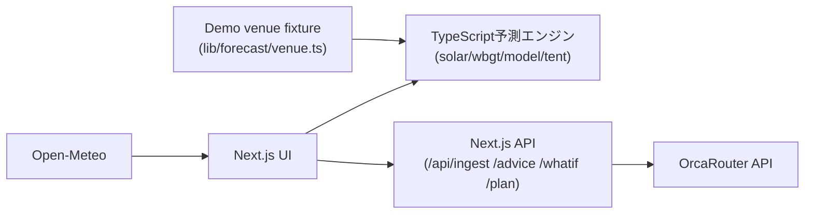

# CROWD WEATHER — TECH STACK

> **位置づけ:** 実装リポジトリの技術仕様（このリポジトリが正）
> **状態:** IMPLEMENTED — 本文書は実装済みのコードを説明する
> **対象:** AI HACK 2026 提出物
> **対象commit:** `main` ブランチ。機能とcommitの対応は §7 の表を参照
> **更新日:** 2026-08-11

構成・書式は中橋氏の `TECH_STACK_SAMPLE.md`（2026-08-10）に準拠。
設計判断の経緯・ベンチマーク・ロードマップは本書に**書かない**
（`docs/` 配下と `.probe-result.md` に分離。役割の混在が旧文書の問題だった）。

## 1. 技術スタック

| 分類 | 採用技術 | バージョン | 用途 |
| --- | --- | --- | --- |
| Runtime | Node.js | v20.20.2（開発機実測） | Web applicationとserver-side APIの実行環境 |
| Package manager | npm | 10.8.2 / `package-lock.json` 追跡済み | 依存の固定 |
| Framework | Next.js（App Router） | 16.3.0 | 画面とAPIを単一projectで実装 |
| UI | React | 19.2.8 | コンソール・入力・予報表示・文書出力 |
| Language | TypeScript | ^5（strict） | Frontend、API、予測logicを共通言語で実装 |
| Styling | インラインstyle + designトークン | — | `lib/forecast/scales.ts` の `INK` に集約 |
| Icons | lucide-react | ^1.30.0 | UI icon |
| AI routing | OrcaRouter API | OpenAI互換 `/v1` | 読解・起草・言語化（§3参照） |
| HTTP client | native `fetch` | — | Server側からOrcaRouterを呼び出す |
| Testing | Vitest | ^4 | 予測logicとAI出力検証層のunit test（22件） |
| 実行時検証 | 手書きの正規化層 | — | `normalizeIngested()` がAI出力をclamp・除外（Zodは未導入・§8） |
| Hosting | Vercel | Hobby（関数60秒上限） | Web applicationとAPIのdeployment |
| Source control | GitHub | private → 提出時にpublic化 | `a2239154301-coder/crowd-weather` |

正確な依存バージョンは `package.json` と `package-lock.json` が正。

## 2. 実装要素と担当技術

| 実装要素 | 実装方法 | 状態 |
| --- | --- | --- |
| 主催者コンソール（予報・推奨オペ） | React + 決定的計算（`lib/forecast/`） | 実装済み |
| 会場資料の読解（写真→ゾーンJSON） | `/api/ingest` → OrcaRouter Vision + Structured Outputs | 実装済み |
| 混雑・暑熱riskの算出 | TypeScript rule-based + 物理式（**LLM不使用**） | 実装済み |
| 太陽位置・影・日陰率 | NOAA近似式 + 影多角形の面積比（`solar.ts`/`model.ts`） | 実装済み |
| WBGT | Kasten-Young日射→Stull湿球→自然湿球・黒球合成（`wbgt.ts`） | 実装済み |
| 気象実況の取込み | Open-Meteo をクライアント直fetch（キー不要・LIVEラベル表示） | 実装済み |
| 運営指示書「やるべきことを出力」 | `/api/advice`（mode=directive・文体切替） | 実装済み |
| 雑踏警備計画書＋総括AI起草 | `/api/plan` + ブラウザ印刷機能でPDF保存 | 実装済み |
| What-if 自然言語シナリオ | `/api/whatif`（言語→条件差分の翻訳のみ。再計算はエンジン） | 実装済み |
| 3系統ブリーフィング | `/api/advice`（audience別に並列生成・モデル使い分け） | 実装済み |
| 来場者アプリ | React（スマホ画面モック） | mock |
| 読解結果の人手補正UI | — | 未着手 |
| 読解Venue→予報計算の配線 | `toVenue()` は実装済み・未接続 | 未着手 |

## 3. 構成概要



- 混雑・暑熱riskはTypeScriptで計算し、**LLMには計算させない**
- LLMの用途は3系統に限定: ①会場資料の読解（Vision） ②文書起草（計画書総括）
  ③言語化・解釈（運営判断・指示書・ブリーフィング・What-if翻訳）
- API keyはbrowserへ置かず、Next.jsのserver側からのみ利用
- 実dataではない値は画面上でラベル表示（Open-Meteo取込みは `LIVE`、それ以外は手入力値）

## 4. API contract（server routes）

すべて `POST`・`application/json`（ingestのみ `multipart/form-data`）。
共通のエラー形: `{ error: string }` + HTTPステータス。
共通のメタ形: `meta = { task, requestedModel, servedModel, fallbackLevel, usage, latencyMs }`。

| Route | Request | Response |
| --- | --- | --- |
| `/api/ingest` | `file`: PNG/JPEG/WebP ≤8MB | `{ venue: IngestedVenue, issues: {level,message}[], meta }` |
| `/api/advice` | `{ mode?: "advice"\|"directive", style?: "standard"\|"easy", audience?: "responsible"\|"staff"\|"visitor", forecast: object }`（旧形式=bodyそのままも受理） | `{ text: string, meta }` |
| `/api/whatif` | `{ question: string, scenario: Scenario }` | `{ result: { changes, interpretation, feasible }, meta }` |
| `/api/plan` | `{ scenario, plan }`（計算済みの値のみ） | `{ text: string, meta }` |
| `/api/models` | GET | モデルID一覧（疎通確認用） |
| `/api/generate` | `{ prompt, strategy? }` | `{ text, model, usage }`（馬場v4互換・/original-v4用） |

型の正本: `lib/forecast/types.ts`（Scenario/Venue/Zone/DayPlan）、
`lib/ai/ingest-schema.ts`（IngestedVenue + JSON Schema）。

## 5. 外部サービス・環境変数

| 項目 | 用途 |
| --- | --- |
| Vercel | Hosting / deployment（mainへのpushで自動デプロイ） |
| OrcaRouter | AI model routing。モデル選定は実測で決定（経緯は `.probe-result.md`） |
| Open-Meteo | 気象実況。無料・APIキー不要・クライアント直fetch |
| `ORCAROUTER_API_KEY` | OrcaRouter認証。server側のみで使用 |
| `DEMO_ACCESS_KEY` | デモ用合言葉ゲート（`/gate`）。未設定ならゲート無効 |

Secretはcommitしない。localは `.env.local`（`.env.example` をコピーして作成）、
本番はVercel Environment Variables。

## 6. 検証手順

```bash
npm install
npm run typecheck   # tsc --noEmit（strict）
npm test            # Vitest 22件: WBGT物理・テント提案・AI出力正規化
npm run build       # 型チェック込みの本番ビルド
npm run dev         # http://localhost:3000
```

CI・lint（ESLint）は未導入（§8）。デプロイは main への push → Vercel 自動ビルド。

## 7. 機能とcommitの対応

| commit | 内容 |
| --- | --- |
| `121b416` | Next.js移植・OrcaRouter結線・`lib/ai/orca.ts`（フォールバック自前実装） |
| `a767771` | 主催者コンソール刷新・会場図と日陰計算 |
| `4201ac3` | 合言葉ゲート（middleware） |
| `f030278` | 会場読解 `/api/ingest`（Vision + Structured Outputs） |
| `cecde55` | アップロードUI・読解を60秒制限内に（gpt-4.1採用） |
| `cad52a7` | 馬場v4原本の無改変保全（`/original-v4`）＋互換API |
| `f07f140` | 暑熱エンジン統合（WBGT物理・Open-Meteo・テント提案） |
| `9f1b4c6` | AI4系統拡張（指示書・計画書総括+印刷・What-if・ブリーフィング） |
| `1ed4968` | 情報設計再編（主催者/来場者モード・ステッパー・コントラスト改善） |

## 8. 実装しないもの・未導入のもの

ハッカソンでは実装しない（中橋氏サンプルの方針を踏襲）:

- Databaseと永続化／Login・権限管理・multi-tenant
- 人流・ticket・GPS・camera等の実data連携（データソース調査は `docs/DATA-SOURCES.ja.md`）
- Machine Learningによる需要予測／Push通知
- PLATEAU等の3D日陰simulation（将来拡張として調査済み）
- 専用PDF生成system（ブラウザ印刷で代替）
- 本番運用向けの監視・SLA・個人情報処理

未導入（提出までに入れる場合はこの表を更新）:

- ESLint（lint scriptなし。型チェックはtscのstrictで担保）
- Zod（AI出力の実行時検証は `normalizeIngested()` の手書き実装。
  clamp・頂点数検証・issues報告まで実装済みのため、置き換えは費用対効果を見て判断）
- CI（GitHub Actions等）。検証は §6 を手動実行
